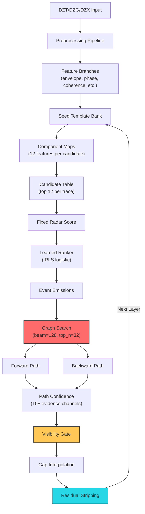

# GPR Automated Layer Tracker – Audit & Roadmap

## 1. What You're Doing Right

Before the critique, credit where due — the foundation is genuinely strong:

- **Bidirectional Viterbi + seed-conditioned graph** — far more principled than simple peak-following.
- **Multi-feature scoring** (envelope, gradient, phase, coherence, correlation, deconvolution, DTW) — the right family of signals.
- **Residual stripping** between layers — critical for resolving thin asphalt over base.
- **Confidence model with 10+ evidence channels** — enables principled gap/review decisions.
- **Design corridor as ≤10% tie-break** — correctly avoids forcing the radar onto a design fiction.
- **Structural break handling, anomaly masking, and provenance tracking** — production-grade infrastructure.

---

## 2. The Black-vs-White Layer Bug 🐛

> [!IMPORTANT]
> You manually trace the **black band** (negative trough / peak-negative lobe of the reflection wavelet), but the tracker locks onto the **white band** (positive peak / peak-positive lobe).

### Root Cause

In [`seed_graph.py`](file:///c:/Users/faisa/Desktop/automate_gpr/src/gpr_layer_audit/processing/seed_graph.py), the tracker builds its template bank and correlation features from the seed waveforms, but the scoring pipeline is fundamentally **envelope-dominant**:

```
generic = 0.17 * residual_envelope       ← unsigned, always peaks on the positive lobe
         + 0.13 * gradient
         + 0.18 * reflectivity           ← absolute value of reflectivity
         + 0.22 * oriented_coherence
         + 0.14 * signed_seed_correlation ← only feature that respects polarity
         + 0.06 * absolute_seed_correlation
         + 0.10 * absolute_strength       ← unsigned
```

The **envelope**, **absolute_strength**, and **reflectivity** features all use `|amplitude|` or the Hilbert envelope, which peaks on the **positive** (white) lobe of the wavelet. The **signed correlation** (14% weight) is the *only* feature that correctly distinguishes black from white — but it's outvoted by ~70% of unsigned features.

### Additionally in `_fixed_radar_score` (line 433–474):
The Talagang-specific layer 2 coefficients weight `absolute_seed_correlation` (0.468) much higher than `signed_seed_correlation` (0.190), further diluting polarity information.

### Fix Strategy

| Approach | Impact | Risk |
|----------|--------|------|
| **Add a polarity-gated envelope**: `envelope * polarity_agreement` so the envelope only fires when the wavelet lobe matches the seed polarity | High — directly fixes the symptom | Low — `polarity_agreement` already exists |
| **Use signed amplitude instead of envelope** in the generic score for seeded tracking | High | Moderate — needs recalibration |
| **Increase signed_correlation weight** to ≥0.30 when seeds are present | Moderate | Low |
| **Add half-cycle offset penalty**: if the candidate's analytic phase is ~π away from the seed phase, penalize it | High — most robust fix | Low |

> [!TIP]
> The cleanest fix is combining approaches 1 and 4: gate the envelope by polarity agreement, and add a **phase-cycle penalty** so candidates on the wrong half-cycle are suppressed. This preserves the tracker's existing multi-feature architecture while eliminating the polarity ambiguity.

---

## 3. Current Shortcomings

### 3.1 Template / Waveform Issues

| Issue | Where | Severity |
|-------|-------|----------|
| **Fixed template radius** (`1.5 × pulse_width`) doesn't adapt to actual wavelet duration, which varies with depth and dielectric | [`seed_graph.py:944`](file:///c:/Users/faisa/Desktop/automate_gpr/src/gpr_layer_audit/processing/seed_graph.py#L944) | Medium |
| **Median-stacked template** is biased by outlier seeds — a single misplaced seed disproportionately affects the template | [`seed_graph.py:84`](file:///c:/Users/faisa/Desktop/automate_gpr/src/gpr_layer_audit/processing/seed_graph.py#L84) | Medium |
| **No waveform-stretching or time-warping** to account for dispersive layers — the template from one end of the road may not match the other end | — | Medium |

### 3.2 Search Corridor Issues

| Issue | Where | Severity |
|-------|-------|----------|
| **Corridor bounds are symmetric** around the design centre — but construction tolerances are often asymmetric (more likely thicker than thinner near subgrade) | [`corridor.py:154-155`](file:///c:/Users/faisa/Desktop/automate_gpr/src/gpr_layer_audit/processing/corridor.py#L154-L155) | Low |
| **Design corridor can be too narrow** when the design thickness has high uncertainty — the ±40% default tolerance may be insufficient for poorly controlled construction | [`corridor.py:173`](file:///c:/Users/faisa/Desktop/automate_gpr/src/gpr_layer_audit/processing/corridor.py#L173) | Medium |
| **No chainage-varying dielectric** — corridor uses a single `base_epsilon` per layer, but dielectric varies significantly along a road (moisture, aggregate changes) | [`corridor.py:103`](file:///c:/Users/faisa/Desktop/automate_gpr/src/gpr_layer_audit/processing/corridor.py#L103) | High |

### 3.3 Viterbi / Path Optimisation Issues

| Issue | Where | Severity |
|-------|-------|----------|
| **`max_jump=7` is hardcoded** — appropriate for ~0.4 m horizontal step but wrong at fine resolution (0.1 m) where the interface can move more samples between adjacent bins | [`picker.py:793`](file:///c:/Users/faisa/Desktop/automate_gpr/src/gpr_layer_audit/processing/picker.py#L793) | Medium |
| **Smooth penalty (0.045)** doesn't scale with horizontal step size — at coarse resolution it under-penalises jagged paths, at fine resolution it over-penalises gentle slopes | [`picker.py:794`](file:///c:/Users/faisa/Desktop/automate_gpr/src/gpr_layer_audit/processing/picker.py#L794) | Medium |
| **Beam size (128)** in graph search may be too small for long roads (>5 km) where the true path diverges early | [`seed_graph.py:648`](file:///c:/Users/faisa/Desktop/automate_gpr/src/gpr_layer_audit/processing/seed_graph.py#L648) | Low |

### 3.4 Confidence Model Issues

| Issue | Where | Severity |
|-------|-------|----------|
| **Fixed threshold for adequate_radar** (e.g., `signal_score >= 0.22`, `seed_correlation >= 0.36`) — these are tuned on Talagang; different antenna, range, or material will have different noise floors | [`seed_graph.py:1028-1041`](file:///c:/Users/faisa/Desktop/automate_gpr/src/gpr_layer_audit/processing/seed_graph.py#L1028-L1041) | High |
| **Confidence weights are fixed** — no adaptation to the quality of the current survey (noisy vs clean data) | [`seed_graph.py:822-832`](file:///c:/Users/faisa/Desktop/automate_gpr/src/gpr_layer_audit/processing/seed_graph.py#L822-L832) | Medium |
| **No explicit "multi-modal" detection** — where two reflectors are equally strong, the tracker picks one but doesn't flag the ambiguity specially | — | Medium |

### 3.5 Preprocessing / Feature Issues

| Issue | Where | Severity |
|-------|-------|----------|
| **Background removal blend (82/18)** is a global ratio — near bridge abutments or utilities the background dominates and 18% isn't enough, while in clean sections 18% introduces unnecessary noise | [`preprocessing.py:336`](file:///c:/Users/faisa/Desktop/automate_gpr/src/gpr_layer_audit/processing/preprocessing.py#L336) | Medium |
| **No migration / focusing** — dipping interfaces and point scatterers (rebar, utilities) are not collapsed, so hyperbolas and diffraction tails can attract the tracker | — | High |
| **No surface-wave / direct-wave removal** beyond dewow — the direct coupling can extend deep enough to interfere with thin asphalt layers (<40 mm) | — | Medium |

### 3.6 Workflow / UX Issues (from the images)

| Issue | Observation | Severity |
|-------|------------|----------|
| **L2 (base) tracking is very noisy** in the Pattoki data (bottom panel) — the cyan tracker line jumps wildly between 240-300 samples, far worse than L1 | Images show significant scatter | High |
| **No visual gap flagging** on the radargram itself — gaps appear as missing lines but aren't highlighted | — | Medium |
| **No per-layer tracking quality summary** — no aggregate metric (e.g., "85% tracked, 12% review, 3% gaps") shown to the user | — | Medium |

---

## 4. Major Value Additions — Prioritised Roadmap

### Tier 1: High Impact, Near-Term (Fix critical tracker accuracy)

#### 4.1 Polarity-Aware Scoring (Fixes Black/White Bug)
- Gate envelope and absolute_strength features by `polarity_agreement`
- Add analytic phase penalty (half-cycle offset from seed phase class)
- **Expected impact**: Eliminates the systematic half-cycle offset visible in all your results

#### 4.2 Adaptive Template Bank with Local Update
Instead of one global template from seeds, maintain a **sliding window template** that updates as the tracker progresses:
- Initialize from seed waveforms
- As the tracker advances with high confidence, blend in local waveforms
- Allows the template to adapt to changing wavelet character along the road
- **Expected impact**: Significant improvement on long roads where layer properties change

#### 4.3 Multi-Resolution Tracking (Coarse-to-Fine)
Your fine retrack already does this partially, but formalize it:
1. Track at ~2 m resolution first (heavy stacking, clean signal)
2. Use coarse path as a tight guide for 0.4 m resolution
3. Use medium path as guide for 0.1 m resolution
- Scale `max_jump` and `smooth_penalty` proportionally
- **Expected impact**: More robust to noise, much faster convergence

---

### Tier 2: High Impact, Medium-Term (Major capability additions)

#### 4.4 Time-Domain Migration / Kirchhoff Focusing
- Pre-migrate the radargram to collapse hyperbolas and sharpen layer boundaries
- Use Kirchhoff migration with estimated velocity model from seed dielectric
- **Expected impact**: Dramatically improves tracking near utilities, rebar, and cracked pavement where diffraction tails currently attract the tracker

#### 4.5 Phase-Based Interface Detection (Phase Picking)
Instead of amplitude envelope, use **instantaneous phase zero-crossings**:
- The zero-crossing of the instantaneous phase at a reflection boundary is more spatially precise than the envelope peak
- Less affected by interference from nearby reflectors
- Combine with current amplitude features as an additional evidence channel
- **Expected impact**: Sharper picks, especially for thin layers where amplitude lobes overlap

#### 4.6 Learned Ranker with Transfer Learning
Extend the current `_fit_candidate_ranker` logistic regression:
- Pre-train on your growing collection of roads (Talagang, Pattoki, etc.)
- Fine-tune on the current road's seeds — your current IRLS fitting is already this
- Add **road-specific feature normalization** to handle different antenna/range settings
- Freeze known-good coefficients per antenna type
- **Expected impact**: Each new road improves future roads; eliminates per-road threshold tuning

#### 4.7 Automated Seed Suggestion with Uncertainty Sampling
Instead of manual seed picking:
1. Run a seedless tracker pass to generate a rough hypothesis
2. Identify locations with **highest tracker uncertainty** (where multiple hypotheses disagree most)
3. Suggest those specific locations for user seeds
4. After 2-3 guided seeds, retrack with much higher confidence
- **Expected impact**: Reduces required seeds from ~5 to ~2 for typical roads

---

### Tier 3: Transformative, Longer-Term

#### 4.8 GPU-Accelerated Tracking (CuPy/PyTorch)
The Viterbi and graph search are the bottleneck. Port to GPU:
- Dense score computation → trivially parallel
- Viterbi forward pass → prefix-scan parallel algorithm
- **Expected impact**: 10-50× speedup, enabling real-time preview during seed placement

#### 4.9 Multi-Channel / Multi-Antenna Fusion
If the GSSI system collects multiple channels:
- Track each channel independently
- Fuse paths with weighted agreement
- Use disagreement as an additional confidence signal
- **Expected impact**: Robustness to channel-specific noise

#### 4.10 Core-Calibrated Ground Truth Pipeline
When core data becomes available:
- Build a proper validation dataset with ground truth depths
- Train/validate the confidence model on actual accuracy
- Calibrate dielectric from core thickness + TWTT
- **Expected impact**: Transforms the tool from "research prototype" to "calibrated instrument"

#### 4.11 Continuous Learning from Analyst Corrections
Every manual correction the analyst makes is a training sample:
- Log all corrections as (location, features, wrong_pick, correct_pick) tuples
- Periodically retrain the ranker on accumulated corrections
- Version the model and track improvement over time
- **Expected impact**: The tool gets better with use, approaching analyst-level accuracy

---

## 5. Quick Wins (Can implement today)

| Quick Win | Effort | Impact |
|-----------|--------|--------|
| Scale `max_jump` and `smooth_penalty` by `horizontal_step_m` | 1 hour | Fixes coarse/fine resolution mismatch |
| Add per-layer summary stats to the UI (% tracked, % review, % gap) | 2 hours | Major UX improvement |
| Log all seed/correction events for future training data | 1 hour | Enables 4.11 later |
| Add a radargram polarity check during preprocessing (detect dominant lobe) | 2 hours | Prevents black/white confusion upfront |
| Expose `minimum_evidence` threshold as a per-layer option | 30 min | Allows manual tuning for difficult layers |

---

## 6. Architecture Observations



The architecture is sound. The main weaknesses are in **feature polarity handling** (§2), **parameter rigidity** (§3.3-3.4), and **missing spatial processing** (§3.5 — no migration).

## 7. Recommended Priority Order

1. **Fix the polarity bug** (§4.1) — this is your biggest single accuracy issue
2. **Add adaptive template updating** (§4.2) — handles long-road variation
3. **Scale Viterbi parameters by resolution** (Quick Win) — fixes known resolution coupling
4. **Multi-resolution tracking** (§4.3) — robustness + speed
5. **Phase-based interface detection** (§4.5) — precision improvement
6. **Kirchhoff migration** (§4.4) — handles structural complexity
7. **Learned ranker with transfer learning** (§4.6) — long-term accuracy gain
